# MatrixApp-LAB8-AREP
MatrixApp es una aplicación web que crea y multiplica matrices cuadrados de n tamaño, el usuario solo debe ingresar el número del tamaño que dese crear las matrices y el programa creará dos matrices diferentes y mostrará el resultado de multiplicarlas.

Las comunicaciones que tiene la aplciación cumplen con los estándares de seguridad y los principios de integridad, autorización y autentitación. Se implementaron un par de llaves (públicas y privada) y se generó un cretificado para poder realizar conexiones a través del protocolo https entre el cliente y el servidor, implementado en un máquina virtual EC2 de AWS. También se usó un contenedor de Docker para almacenar la aplicación.

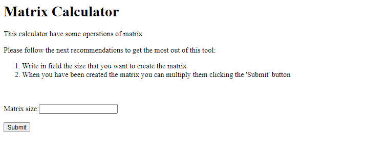

## Tutorial de Disponibilidad y Desempeño
En este tutorial se explicará  una forma de usar las capacidades de autoescalamiento de Amazon Web Services. La aplicación MatrixApp tiene esta capacidad y su construcción es un ejemplo de las diferentes oportunidades que nos brinda AWS con esta herramienta.

Las matrices son una de las estructuras de datos que más se usan actualmente, gracias a la capacidad de almacenar gran cantidad de información de una forma ordenada. Cuando tenemos que operar matrices de gran tamaño, nustras aplciaciones o servidores, varias veces se quedan colgados. Este es un buen caso para probar las grandes ventjas del escalamiento.

Antes de Iniciar el tutorial, debemos crear una instancia de EC2, preferiblemente, Ubuntu Server 18.04 LTS. No olvide descargar el par de la instancia y crear un nuevo grupo de seguridad.

1. Vamos al panel de EC2, seleccionamos la instancia que acabamos de crear y damos click derecho sobre ella para crear una imagen (AMI).

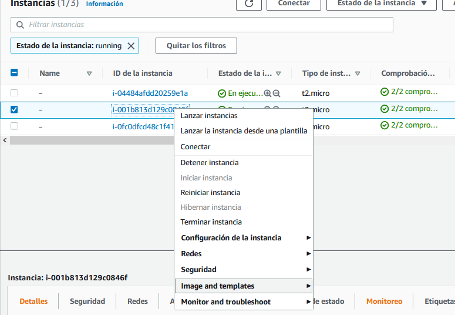
  
2. Vamos a crear una plantilla de lanzamiento para nuestras instancias de EC2. Dirijase a la sección de "Auto Scaling" y seleecione la opción de Launch Configuration. 

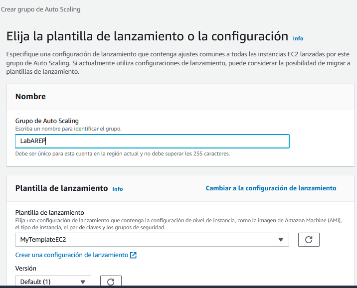

* En la sección de AMI, vamos a seleccionar la imagen que creamos en base a la instancia EC2.

* Cuando aparezca la sección de Grupo de seguridad, vamos a seleciconar el grupo que creamos anteriormente. Más adelante nos aprecerá una sección llamada Par de Llaves, aquí debemos seleccionar el nombre del par de llaves que creamos al inicio del tutorial.

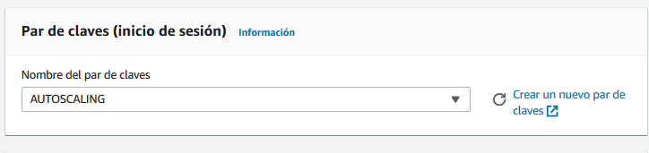

* Seleccionamos la opción Adhedirse a plantilla de lanzamiento. 

  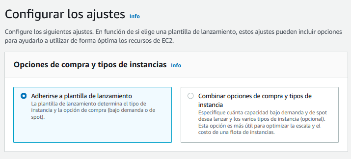

* En la sección de red seleccionamos las diferentes regiones en donde va a estar presente nuestras instancias. Es recomendable seleccionar más de una región para garantizar una alta disponibilidad.

  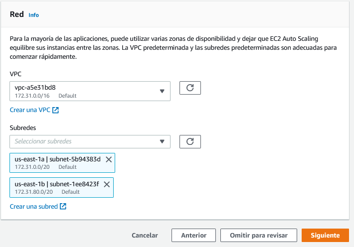

* Es importante definir las políticas de escalado, aquí vamos a establecer el tipo escalamiento y el tipo de métrica que vamos a usar.

  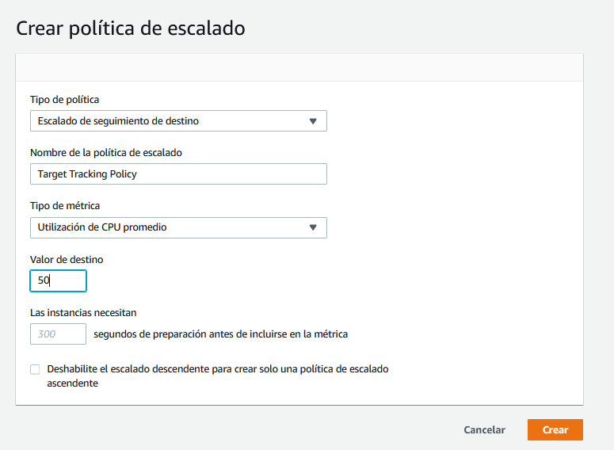
  
* Podemos añadir un balanceador de carga a nuestro grupo de Auto Scaling. Si queremos añadir este recurso, debemos dar click en la opción de crear un nuevo Load  Balancing y seleccionar la primera opción que se muestra.

  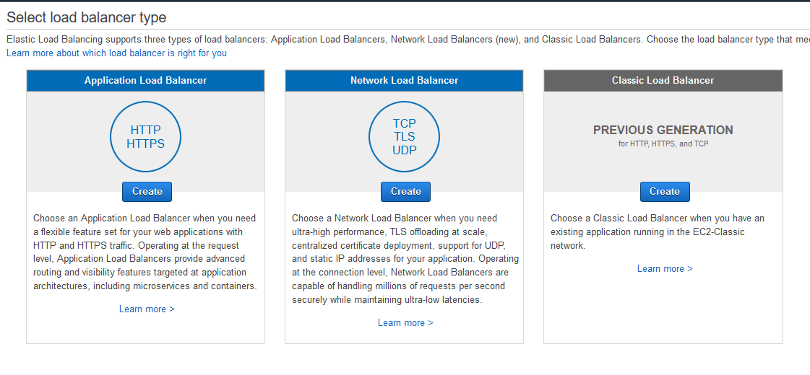
  
* En la sección de Available Zones marcamos las mismas zonas donde vamos a desplegar nuestras instancias de EC2

  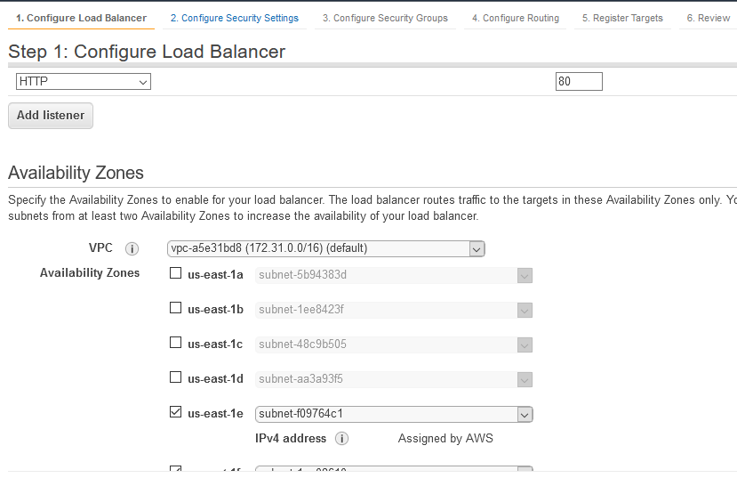
  
* También debemos definir el puerto por el cual va correr nuestra aplicación y el tipo de protocolo que vamos  a usar.
  
  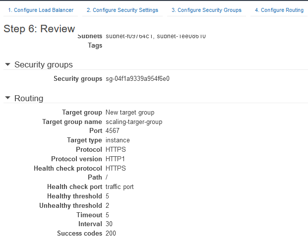
  
* Cuando ya hemos creado el Load Balancing, volvemos a la sección de Plantillas de Lanzamiento y añadimos el nuevo balanceador que acabamos de crear.
  
* Por último, seleccionamos el botón de "Crear grupo de Auto Scaling"
 
  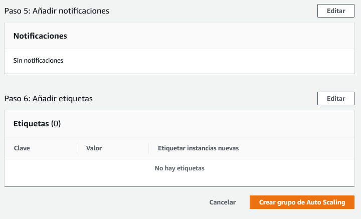
  
  
3. Verificar que nuestro grupo Auto Scaling se desplegó exitosamente, podemos acceder a la opción Auto Scaling de la parte inferior del menú de AWS y revisar la opción del menú horizontal "Hisotrial de Actividad", si el proceso fue exitoso, el estado de la instancia aparecerá en Succesfull como se ve acontinuación.
  
  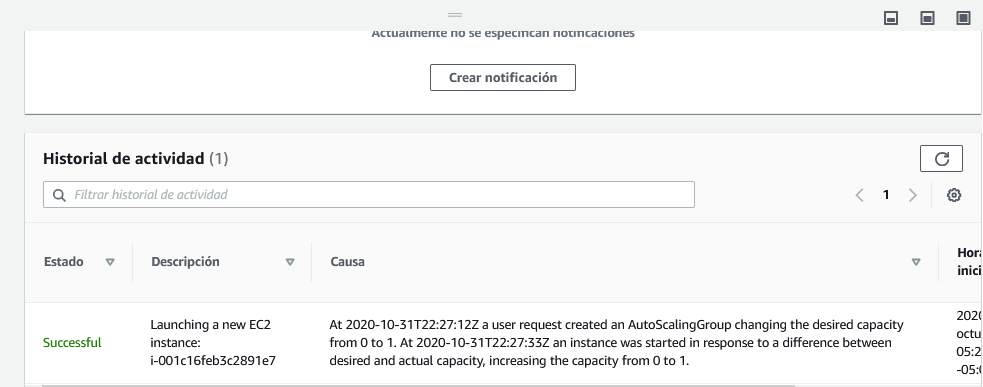
  
 
4. Prueba de Auto-Escalabilidad

Para probar la auto-escalabilidad de la aplicación, se realizaron diferentes peticiones que hicieron aumentar el nivel de uso de cpu de la instancia inicial.
Se desplegaron dos instancias nuevas para repsonder a la gran cantidad de peticiones.

Esta es una imagen del panel de EC2, donde se pueden ver las instancias generadas

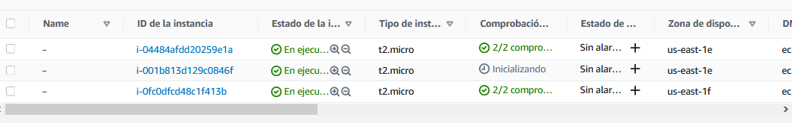

En el panel de Auto Scaling, al seleccionar el grupo ed Auto Scaling que creamos, nos aparecerá un menú horizontal con la información básica del recurso. En este menú hay dos opciones que nos permiten evidenciar el escalamiento:

* Si revisamos la opción Actividad, nos debe aparecer que se crearon más de una instancia de la plantilla que definimos y sus estados deben ser Succesful.

  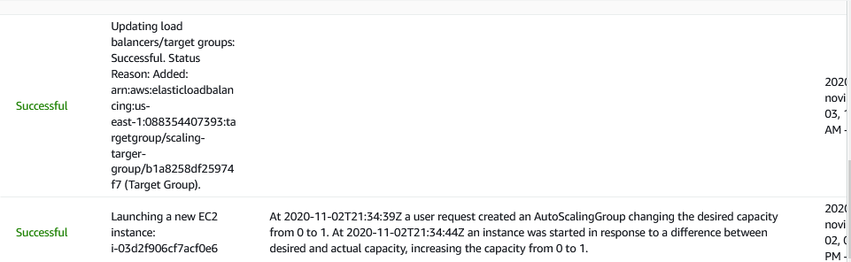

* En la opción de Monitoreo, vamos a encontrar varias gráficas, en la gráfica de Instancias en servicio, aparece el número de instancias que actualmente están funcionando en el grupo de Auto Scaling, si el escalamiento se hzio de forma correcta, este valor debe ser mayor a uno.

  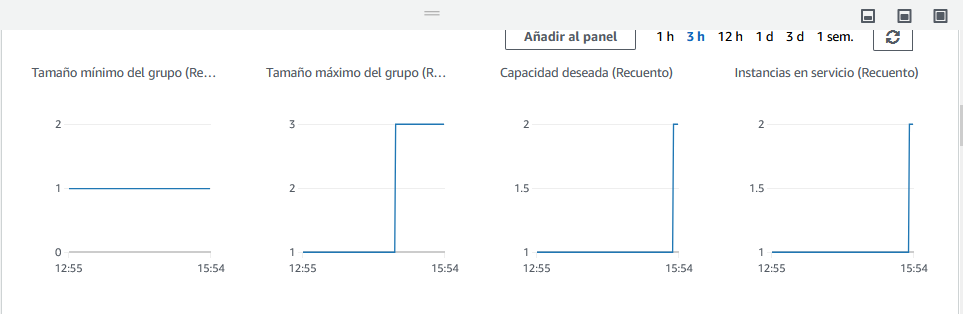

## Construido con
* [Maven](https://maven.apache.org/) : Herramienta encargada de la construcción del proyecto y el manejo de dependencias
* [Spark](https://spark.apache.org/docs/0.9.1/java-programming-guide.html) : Framwework para desarrollo de aplicaciones web
* [Git](https://git-scm.com/) : Sistema de control de versiones.
* [CircleCI](https://circleci.com/) : Integración contínua 
* [AWS](https://aws.amazon.com/es/education/awseducate/) : Proveedor de servicios cloud 
* Java : Lenguaje de Programación.
## Autor
* **Andrés Rocha** - [andresro30](https://github.com/andresro30)

## Licencia 
Este proyecto está licenciado por Apache License 2.0 - mira aquí [LICENSE.md](LICENSE.txt) los detalles
